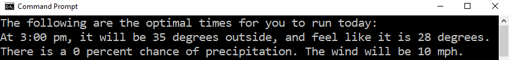

runPredictor is a python application which states which times would be best to run in a given day based on parameters set by the user.

It scrapes table data from https://weather.com/.

The output is formatted like this:

The current version is a command line program in Python 3.  To run:
    1. Fork the repository.
    2. Pull repository into a folder.
    3. Navigate to that folder in the command line.
    4. $ py runPredictor.py 

To run you will need the following libraries: requests, beautifulsoup4
    pip install beautifulsoup4
    pip install requests

To change the settings, navigate to rows 10-14 in runPredictor.py.
