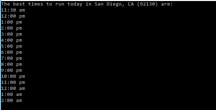
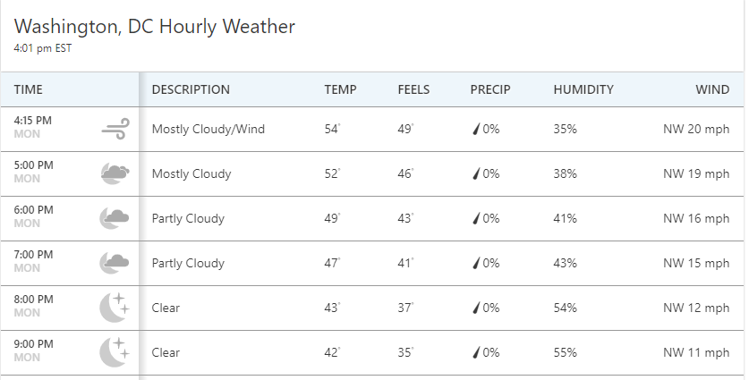

runPredictor is a C# application which states which times would be best to run in a given day based on parameters set by the user.

The output is formatted like this:

It scrapes table data from https://weather.com/.

The current version is a command line program C#.  To run:
    1. Change the settings in the settings.txt file to your liking.
    2. On line 21 of Settings.cs, the path needs to be changed to where your settings.txt is located.
    3. Compile and run program.
